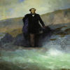
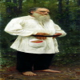
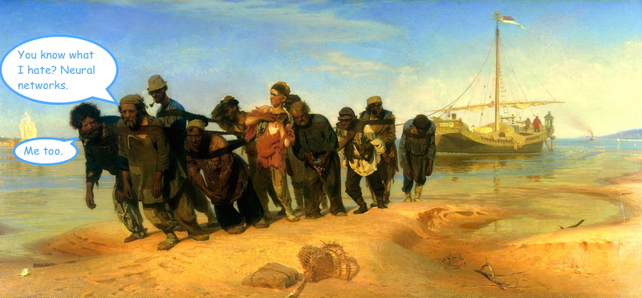
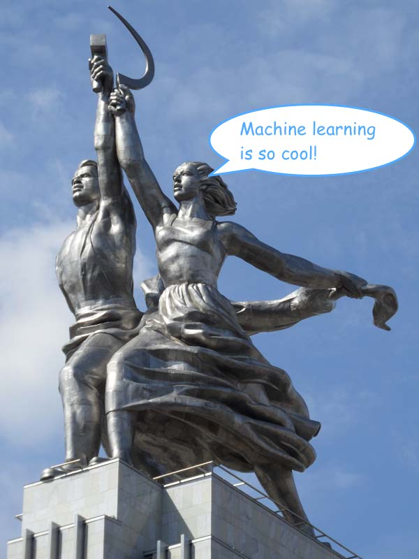
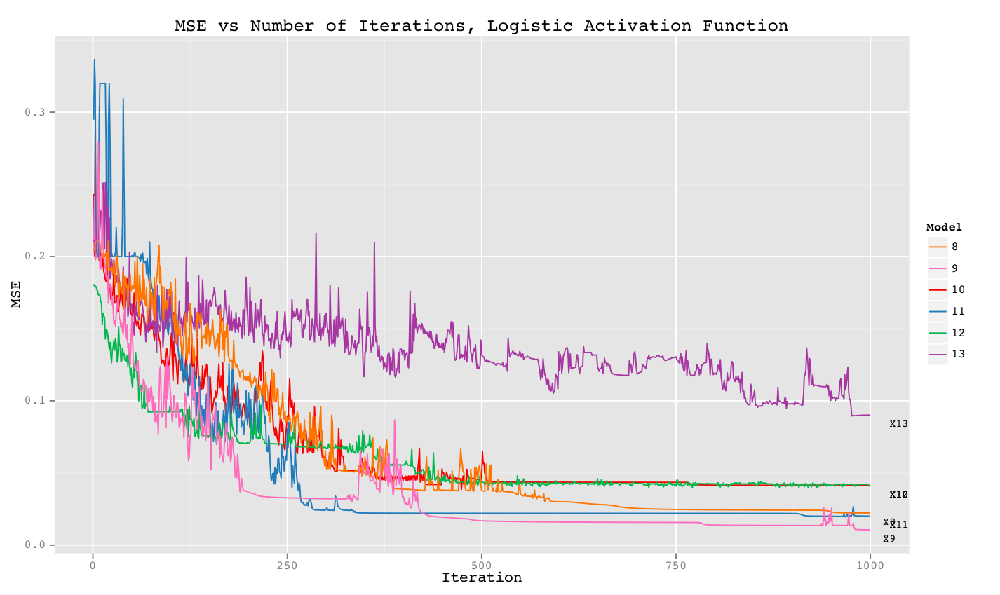
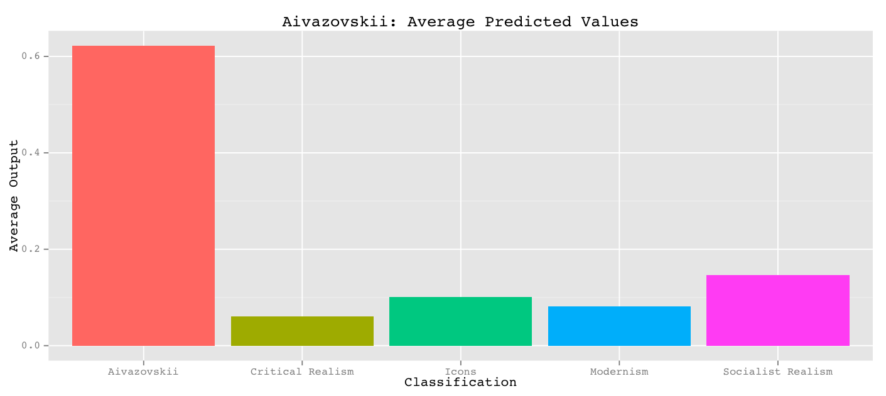
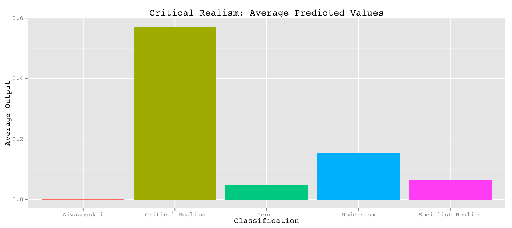
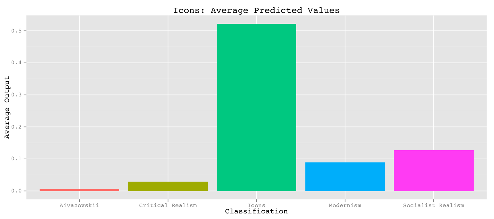
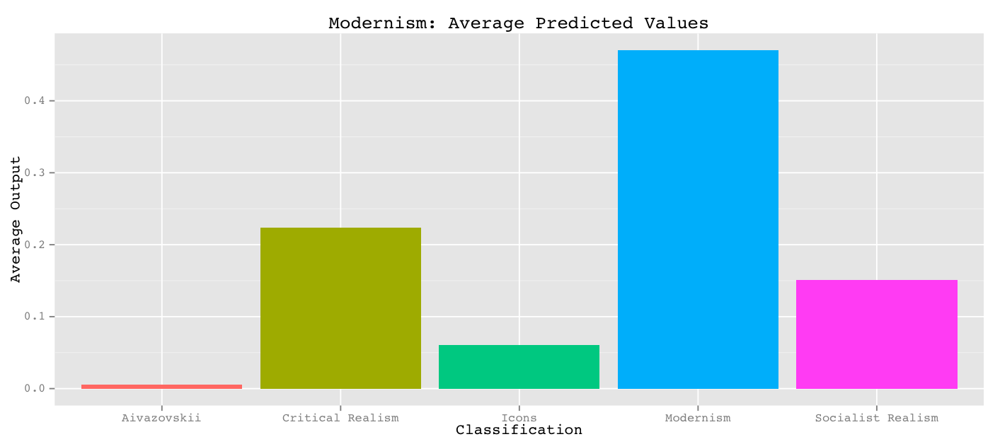
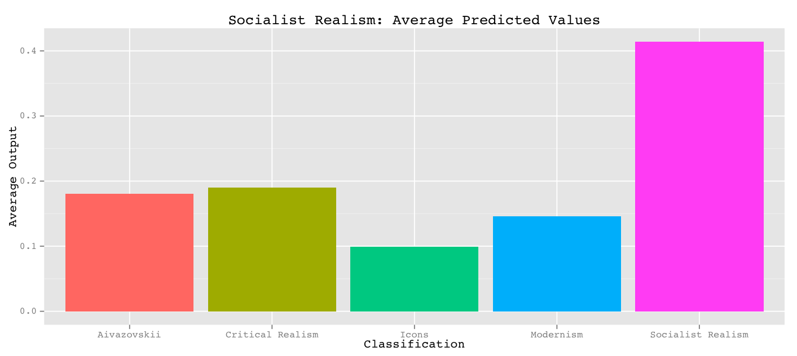

# Mir Iskusstva  
A program to categorize Russian paintings by artistic movement, using neural networks and backward propagation of errors.  
Sophia Davis  
AI Final Project, Carleton College, Spring 2014 

------------
## Important Files:  
####Data
Original image files are contained in the following subdirectories:  

* Aivazovskii  
* CritRealism  
* Icons  
* Modernism  
* SocRealism 

Each image as saved as 'painter_paintingName' (except the ones by Aivazovskii, which are just 'paintingName'). 

Rescaled images (used to obtain color features of each image) are located in the corresponding '/small' subdirectory (i.e. Aivazovskii/small)

####Data Processing
* resize.py -- rescales images to 100x100px (using ImageMagick command-line tools)  
* processColors.py -- extracts information about colors present in reduced-sized images (using ImageMagick), saves results to csv file  
* rescaleData.R -- script to standardize all input vectors to the range \[-2, 2\] (processes csv file produced by processColors.py)  


####Training/Testing Neural Network:  
###### Training:
* node.py -- classes/functions for network nodes, including which activation function will be used (hyperbolic tangent or logistic)  
* data.py -- classes/functions for data  
* trainNetwork.py -- contains 'trainNetwork' function to train neural network given specified hidden node structure (number of hidden layers and nodes per layer), learning parameters, and a training set. Returns trained network, average weight change on the final iteration, and change in mean squared error (MSE) on the training set after each iteration.  

###### Testing:
* testNetworkParams.py -- evaluates the performance of network on training set given different combinations of network parameters: α (learning rate), μ (momentum rate), and hidden node structure. For each combination, the MSE at each iteration is recorded. Results are saved to csv file.  
* crossValidate.py -- uses k-fold cross validation to evaluate network performance on unknown data. Metrics such as MSE on test set and output from each output node (for each item in test set) are saved to csv file.     


####Evaluate Performance:  
* trainingSetResults.R -- script to graph MSE of network on training set vs. iteration number (given csv produced by testNetworkParams.py)   
* testSetResults.R -- script to analyse performance of trained network on test data (given csv produced by crossValidate.py)  

####Results:  
* imageColorData.csv -- output of processColors.py  
* imageColorData_Standardized.csv -- contents of imageColorData.csv after standardization to \[-2, 2\] (using rescaleData.R). 
**This file was used to obtain all network performance statistics.**   
* results_final.csv -- output of crossValidate.py, using data from imageColorData_Standardized.csv, and k = 20 unique training/test sets (each test set contained one painting from each movement, and training was conducted with all other data). Each network contained one hidden layer with 24 nodes (the average number of input and output nodes), and was trained for 1500 iterations with α = 1000/(1000 + numIterations), and μ = α/2. 

The following files contain information about network performance on a training sets (MSE after each iteration and average weight change after final iteration), given various combinations of α, μ, activation function, and hidden node structure (output of testNetworkParams.py):  

* 1000 iterations, logistic activation function:  
  * trainingPerformanceLogistic.csv   
  * trainingPerformanceLogistic2.csv  
* 1000 iterations, hyperbolic tangent activation function:  
  * trainingPerformanceTanh.csv  
  * trainingPerformanceTanh2.csv  

------------

## To Run: 

```
python crossValidate.py imageColorData_Standardized.csv output.csv
```
crossValidate.py is currently set to separate data into just k = 2 pairs of training/test sets and train a network for 10 iterations on each training set (using α = 1000/(1000 + numIterations), μ = α/2, 1 hidden layer with 24 nodes, and the logistic activation function). The results on each corresponding test set (MSE, output of all output nodes, and the classification with maximum output) will be printed to the screen and saved to output.csv. This will run to completion very quickly and produce very awful results.  

------------

## Methodology
##### Name
Obviously, the first step was to name my project. I decided on Mir Iskusstva, after the early 20th century Russian avant-garde artistic movement and magazine, Мир искусства (World of Art).

##### Data 
Next I needed to track down paintings. I chose to work with five different artistic movements. In order to make image classification easier for my neural network, I chose categories that were very different from each other and tried to make each category homogeneous, by selecting works from as few artists as possible.  

I ended up with 100 paintings in total, with 20 representing each of the following styles:

1. Icons -- Andrei Rublev
2. seascapes by Ivan Aivazovskii -- not really a movement (probably fits into Romanticism), but Aivazovskii's seascapes are so distinctive
3. Critical Realism -- Surikov (10 paintings) and Repin (10 paintings) 
4. Modernism -- Kandinskii
5. Socialist Realism -- mostly Deyneka, but I had to include work from a couple other artists to get 20 paintings...

I downloaded digital versions of most paintings either from the [Tretyakov Gallery's massive online collection](http://www.tretyakovgallery.ru/ru/collection/_show/categories/_id/42) or from [Gallerix](http://gallerix.ru/), an even larger digital collection of paintings, "founded with the goal of popularizing the art of painting among the vast masses of the population, and satisfying the desire of seeing the beautiful among people who don't have the opportunity to personally visit museums." Between these two sites I still hadn't turned up 20 distinctively Socialist Realist paintings, so I turned to Google Images.

##### Image Processing
All image processing was conducted using [ImageMagick command-line tools](http://www.imagemagick.org/script/command-line-tools.php).

I started off by making all images the same size -- 100px by 100px, ignoring aspect ratio (see `resize.py`). ImageMagick provides several ways to do this, but I chose to '[scale](http://www.imagemagick.org/script/command-line-options.php#scale)' the pictures ("minify / magnify the image with pixel block averaging and pixel replication, respectively").

Some pictures suffered from the disregard to aspect ratio more than others. For example, Aivazovskii's Pushkin put on a little weight:  
 

And Repin's Tolstoy had it even worse:  
 

Oh well.

Next, I figured out how to calculate a few simple metrics about the color features of each image to use as input for a neural network (see `processColors.py`). These included the [total number of unique colors](http://www.imagemagick.org/script/escape.php) and the [average red, green, and blue value](http://www.imagemagick.org/Usage/quantize/#colors). I also incorporated information from a luminosity histogram and histograms of the red, green, and blue channels of each image. The [ImageMagick histogram command](http://www.imagemagick.org/Usage/files/#histogram) returns the total number of pixels with each color value. I considered 10 ranges of color value, and used the counts of pixels with value in each bin (for each channel) as a separate input feature. This resulted in 44 different input features.  

Color metrics were calculated from the resized versions of the paintings, and are saved in `imageColorData.csv`.


##### Algorithm

I implemented a feed-forward neural network using the basic backwards propagation of errors formula to update weights between nodes. There were 44 input nodes (one for each color feature) and 5 output nodes (one for each painting movement). Initial weights were generated randomly from [-0.05, 0.05]. The order of the data set was randomized, and the network was trained on each painting in turn for a set number of iterations through the data set.  

Although my data was categorical (each item belongs to 1 of 5 classifications), the output of each node was still continuous in nature. Thus, error at the output nodes was calculated as:  

* 1.0 - (node output) -- if the current painting belonged to the category represented by the output node  
* 0.0 - (node output) -- otherwise

After doing some research, I also added a momentum term. The basic idea is:  
Let ν(i) be the amount by which a given weight will be increased after iteration i.  

ν(i) = α * gradient + μ * ν(i - 1)    

Thus, whenever a weight is updated, a fraction of the previous weight update is added. In backprop, weights are updated based on how the network performed on one example at a time. The momentum term serves to provide some continuity, by adding information "learned" from previous examples into the current weight update. Momentum can also help "push" weight values past local minima, in the hopes that weights will continue to update until the true global minimum has been found.  

[This paper](http://www.cs.toronto.edu/~fritz/absps/momentum.pdf) by some people at the University of Toronto and [this one](http://axon.cs.byu.edu/papers/IstookIJNS.pdf) by some guys at Brigham Young University were most helpful giving me a basic understanding of what momentum is.

I mostly used the logistic function as my activation function, but I also played around with the hyperbolic tangent function, because [this guy](https://carleton.mnpals.net/vufind/Record/.b14357501) said it could help the network converge faster. * Spoiler alert * I couldn't get it to help.

##### Standardization of Inputs
I began by training my neural network on a random subset of data from the `imageColorData.csv` file. My goal was to play around with α, μ, and the hidden node structure (based on values suggested in the neural network literature) until I found which set of network parameters most reduced MSE on the training set.

No matter what combination of parameters I chose and no matter how long I ran my network, I couldn't get MSE to fall below 0.16. I felt like these guys:  


I finally realized that the output of the hidden nodes was almost always 1.0. Of course MSE wasn't decreasing very much: MSE is calculated at the output nodes, and the input to the output nodes was always the same. Because my input values were so enormous (pixel counts tend to be big), no matter how small I made my initial weights, after a few iterations, the hidden nodes became "saturated" -- the activation function would never return anything but 1.0. 

I did some more research, and eventually found [this paper](http://www.faqs.org/faqs/ai-faq/neural-nets/part2/), by an ANN God named Warren S. Sarle. It has a whole section on why and how inputs to neural networks should be standardized (search "Subject: Should I normalize/standardize/rescale"). Apparently, "scaling is an
   important consideration for gradient descent methods such as standard
   backprop." I used the formulae given by Sarle to standardize all of my input vectors to the range \[-2, 2\] (see `rescaleData.R`; standardized data set saved as `imageColorData_Standardized.csv`).

As soon as I began training a network on the standardized data, MSE started decreasing right away. Lovely. I felt like this:  
  
 
## Results

##### Performance on Training Sets
Once my neural network appeared to be capable of learning (yay!), I wrote a script that would train neural networks using several different combinations of parameters, and save the MSE from each iteration in a csv file (see `testNetworkParams.py`; output in `trainingPerformanceLogistic.csv`, `trainingPerformanceLogistic2.csv`, `trainingPerformanceTanh.csv`, and `trainingPerformanceTanh2.csv`). Training was conducted on my entire data set.

I couldn't get any parameter combination to successfully reduce MSE when using a hyperbolic tangent activation function. Perhaps if I spent more time messing with α and μ, I could get some decent convergence. However, since some of the networks using a logistic activation had shown evidence of convergence, I didn't press the issue.   


Using the logistic function as the activation function was, in general, more successful. Of the following parameter combinations (some are repeats), model numbers 8 through 13 produced networks with fairly low training set MSE after 1000 iterations, and their performance is represented in the graph below.

|Model|α|μ|Hidden Structure|Final Avg. Weight Change|  
| :------------- |:-------------:|:-------------:| :-------------:|:-------------:|  
|1|0.4|0.9|[24]|4.816977e-09|  
|2|1000/(1000 + x)|0.9|[24]|2.861154e-08|  
|3|1000/(1000 + x)|0.9|[32, 24]|2.696963e-09|  
|4|1000/(1000 + x)|0.9|[32]|1.446811e-10|  
|5|1000/(1000 + x)|0.9|[44]|6.896931e-14|  
|6|1000/(1000 + x)|0.9|[5]|4.425181e-04|  
|7|1000/(1000 + x)|1 - 3/(x + 5)|[24]|3.121103e-10|  
|**8**|**1000/(1000 + x)**|**α/2**|**[24]**|**3.850372e-06**|  
|**9**|**1000/(1000 + x)**|**α/2**|**[24]**|**1.503116e-04**|  
|10|1000/(1000 + x)|α/2|[32]|1.119652e-06|  
|**11**|**1000/(1000 + x)**|**α/2**|**[44]**|**9.061062e-06**|  
|12|1000/(1000 + x)|α/2|[5]|2.555765e-03|  
|13|1000/(1000 + x)|α/2|[24, 32]|1.172053e-03|  
|14|1000/(2 * (1000 + x))|0.9|[24]|7.026136e-04|  
|15|2 * μ|1000/(2*(1000 + x))|[24]|7.701949e-04|  



Models 8, 9, and 11 (bolded) performed best. 8 and 9 actually used the same combination of parameters, and model 11 also had the same α and μ. But whereas 8 and 9 had a single layer of 24 hidden nodes (the average number of input/output nodes), 11 had 44 hidden nodes (the same as the number of input nodes). To avoid overfitting the data, I opted for the parameters used in models 8 and 9. These also resulted in relatively high final average weight changes, so I hoped that perhaps the weights would change even more (and the network would show even better convergence) if I could train the network for longer.


##### Performance on Test Sets
After settling on the logistic activation function, α = 1000/(1000 + x), μ = α/2, and a single layer of 24 hidden nodes, I proceeded to cross validate my neural network.

I divided the data into 20 unique training/test set pairs. Each test set contained one picture representing each category, and the corresponding training set contained all other pictures. The network was trained for 1500 iterations (see `crossValidate.py`; output in `results_final.csv`).

Now, recall that -- although my data is categorical -- each output node returns a value in a continuous range. I simply used the classification corresponding to the output node with the highest output value as the network's "prediction" of the classification of a given painting. Using that metric, there was a 55% overall success rate. The table below lists number of successes by trial, as well as MSE on both training and test sets. Trial 2 (bolded) had the best performance overall.

|Test Number|Correct|Incorrect|MSE on Training Set|MSE on Test Set|  
| :-------------|:-------------:|:-------------:| :-------------:|-------------:|   
|1|3|2|0.021113856|0.18510327|  
|**2**|**5**|**0**|**0.019018235**|**0.03510553**|  
|3|3|2|0.031612875|0.11206679|  
|4|4|1|0.019894575|0.04048364|  
|5|2|3|0.016983443|0.22665282|  
|6|3|2|0.029581011|0.11527369|  
|7|2|3|0.011165801|0.16166198|  
|8|2|3|0.020525809|0.19985612|  
|9|2|3|0.006390899|0.19643967|  
|10|3|2|0.012834621|0.12223814|  
|11|3|2|0.012815334|0.17885093|  
|12|2|3|0.006406209|0.19219258|  
|13|3|2|0.008480505|0.15246886|  
|14|2|3|0.008598175|0.28520785|  
|15|1|4|0.014824077|0.26372471|  
|16|3|2|0.033807571|0.09967330|  
|17|4|1|0.010711561|0.05955265|  
|18|2|3|0.025845815|0.19930991|  
|19|4|1|0.033968625|0.04044056|  
|20|2|3|0.021225349|0.21411173|  

However, by considering only the classification from the output node with the highest returned value, we're losing all information provided by the other output nodes.  

Each of the following bar charts considers output node information given the 20 paintings in a certain category (pooling results from all test sets). The height of each bar indicates the average prediction of the output node representing the category labeled on the x-axis. In each graph, the highest bar is clearly the bar corresponding to the correct classification. In conclusion, Победа!

  
  
  
  
  
